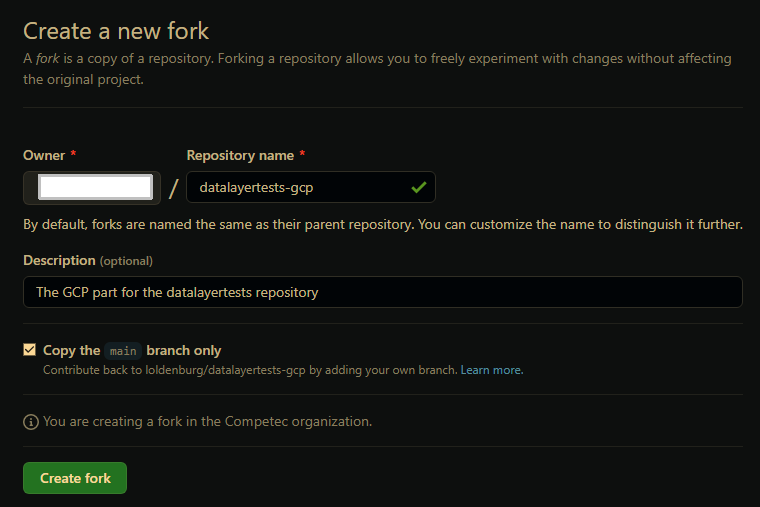
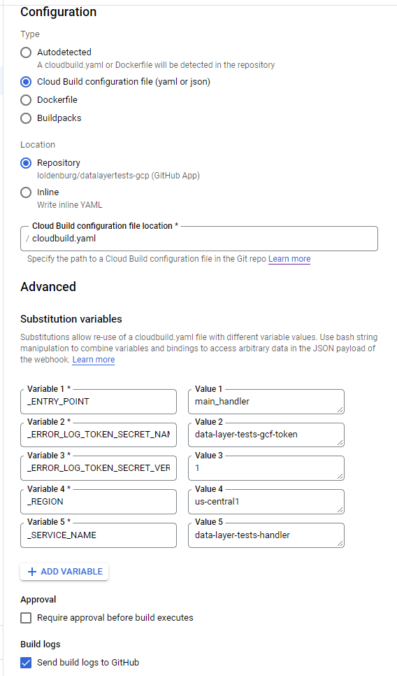
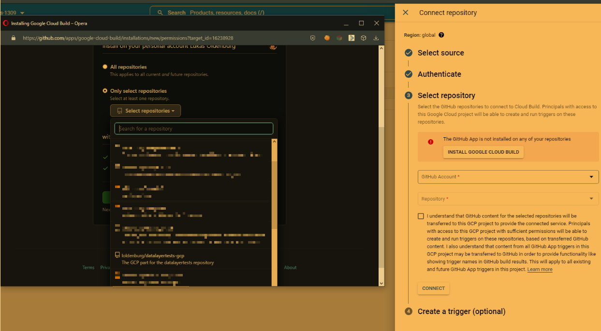

Server-Side, Data Layer Validation, Google Cloud Platform Setup Guide
==============
This repo complements the server-side data layer testing framework from https://github.com/loldenburg/datalayertest with
code for Google Cloud Functions, Firestore and BigQuery as well as a step-by-step setup guide.

The ideas and benefits of it are presented in this article:
* https://thebounce.io/use-your-server-side-tms-to-qa-your-data-collection-in-the-real-world-7137376ca9a9

# Step-by-step Guide

## 1. Install/Enable required tools

1. You need a billing-enabled GCP project (
   see: https://cloud.google.com/resource-manager/docs/creating-managing-projects)

### Recommended (for local runs, code changes etc.)

1. Have Git installed on your machine https://git-scm.com/downloads
2. For local runs & tests, you nodeJS, Python 3.9 (3.6-3.10 should also work) and an IDE (recommended: PyCharm)
3. Install the Google Cloud SDK CLI (see: https://cloud.google.com/sdk)
4. Authenticate Google Cloud SDK CLI: `gcloud auth login --update-adc`

## 2. Fork the GitHub repo

1. Go to https://github.com/loldenburg/datalayertests-gcp
2. Click on "Fork" and fork the project. You now have your own GitHub repository with a copy of the code.
   

## 3. Set up Google Cloud Project components

0. Enable Resource Manager API: `https://console.cloud.google.com/apis/library/cloudresourcemanager.googleapis.com`

1. Go to the **Google Cloud Functions**
    1. Click "create function".
    2. Enable the APIs shown.
    3. When you get to the screen to set up the cloud function, click the "back" button to return to the Cloud Functions
       overview page.

2. Go to **Secret Manager** and enable the Secret Manager API:
   2.1. In Secret Manager, create a secret called "data-layer-error-log-token" with the value of the GCF token set
   earlier in
   Tealium Functions.
   This will be used to authenticate the data layer error log cloud function. It has to be part of your Tealium Function
   request to the Cloud Function.
   2.2 Ensure default service account for GCF has `Secret Manager Accessor` role

3. Go to **Google Cloud Build** and enable the API if not already enabled.
   Cloud Build Triggers will build (=update) your cloud functions every time you push a change to your GitHub
   repository's "main" branch.
    0. Enable `Cloud Functions Developer` and `Secret Manager Secret Accessor` roles for Cloud Build Service Account. 
    1. Select "Triggers" and then "Create Trigger".
    2. Fill the fields as provided in the screenshots below (select a different region if your cloud function runs
       elsewhere).
    3. Under "Source", select "Connect New Repository", then "External Repository", then "GitHub". Then select your
       forked GitHub repository.
       
       
       
    4. Under "Build Configuration", select "Cloud Build configuration file (yaml or json)" and confirm "
       /cloudbuild.yaml" as the file name.
    5. Now run the trigger once manually. This will create the cloud functions in your project.

4. Go to **Firestore**
    1. Select Native Mode
    2. Region: nam5 (United States) “multi-region” (or the same region where your cloud function runs)
    3. Click “start collection”
    4. Name the collection “dataLayerErrorLogs”
    5. Delete the document again that Google creates automatically (click the three dots next to it and then "delete")

5. Go to **Cloud Functions** to get **Trigger URL**
    1. Click on the newly created cloud function "data-layer-tests"
    2. Click on "Trigger"
    3. Copy the Trigger URL

6. Go to **Tealium Functions**
    1. Edit Function -> Global Variables
    2. Create a new variable called "urlGCF" and set the value to the Cloud Function Trigger URL from step 5.3
    3. Uncomment the rows below `// UNCOMMENT THIS IF YOU HAVE YOUR OWN GCLOUD CONNECTION`
    4. Save the function
    5. Publish your Tealium CDH profile. You are done!

If you want to monitor your data with BigQuery and Data Studio, you can additionally follow the steps below.

## BigQuery & Data Studio integration

### BigQuery

1. In your GCP project, go to BigQuery -> SQL Workspace.
2. Click on the 3 dots next to your project ID and select "create dataset".
3. Name the dataset `datalayer_errors`.
4. Choose a region that matches the region of your Cloud Function (default "us-central1")
5. Click into the SQL query editor tab on the right.
6. Create the table where the data layer errors will be held by copying and running the following SQL query,
   replacing `{{your_project_id}}` by your GCP project ID:

```sql
#@formatter:off
-- copy query from here...
CREATE TABLE IF NOT EXISTS
  `{{your_project_id}}.datalayer_errors.datalayer_error_logs` ( 
    event_id STRING NOT NULL,
    event_name STRING NOT NULL,
    error_types STRING,
    error_vars STRING,
    logged_at TIMESTAMP NOT NULL,
    url_full STRING,
    user_id STRING,
    tealium_profile STRING 
    )
-- ...to here
#@formatter: on
```
7. Go to IAM. Select the "App Engine default service account" and confirm that this account has "Editor" permissions. #todo check if that is correct!
8. Finally, go into your code editor and open the file `data-layer-tests-gcp/datalayer_error_log.py`.
9. Change the row `big_query_enabled = False` to `big_query_enabled = True` and push to the main branch of your GitHub repository. 
10. After the build, your cloud function will now write all your data layer errors to BigQuery.

### Data Studio

tbc